  

  
  

## Hi, I'm Rafael

I'm a **Computer Science student at Universidade Estadual de Londrina (UEL)**, Brazil, with graduation expected in **July 2027**. I build backend services, native iOS apps and automation tools, and I'm developing my skills in **reverse engineering and cybersecurity** through independent study and hands-on projects.

My experience connects production software with the fundamentals behind it: APIs and databases, networking and distributed systems, compilers, assembly and debugging. I'm especially interested in understanding how programs behave beneath the source code.

- **Currently:** Full Stack Intern at **ORV**.
- **Previously:** Backend Developer at **PET-Saúde I&SD — UEL**.
- **Exploring:** binary analysis, x86-64 assembly, fuzzing and vulnerability research.
- **Languages:** Portuguese (native) · English (upper-intermediate to advanced).

## Selected project / ASM X

### [An x86-64 assembly visualizer & educational debugger](https://github.com/Rafawaldrigues/x86-assembly-visualizer)

A desktop environment I built with **Python + Tkinter** to make assembly easier to study, inspect and test.

| Read & understand | Execute & investigate |
| :--- | :--- |
| Custom parser for NASM/Intel, MASM and GAS/AT&T | Step-by-step execution in an educational virtual machine |
| Control-flow maps with functions and basic blocks | Breakpoints and register, flag, stack and memory inspection |
| Static linter with **30 validation rules** | Isolated test scenarios with initial states and expected outcomes |
| Reference for **148 mnemonics** and **43 Linux syscalls** | **141 automated tests** documented in the repository |

> ASM X simulates assembly for learning; it does not assemble, link or execute real binaries.

**[Explore the source →](https://github.com/Rafawaldrigues/x86-assembly-visualizer)**

## Experience / software in practice

### ORV · Full Stack Intern
**July 2026 — Present**

- Developed and published **Mori Camera**, a native **Swift / iOS** app for capturing photos and videos over a time interval.
- Collaborated on **FastAPI CRMs**, including AI agents that support lawyers with case intake and assistance.
- Integrated **WhatsApp customer service with a custom AI agent** to automate client assistance.
- Delivered institutional websites and landing pages for clients.
- Built prospecting tools with **Playwright, Selenium and SQLite**, including custom deduplication.
- Deployed web applications and configured and administered **VPS servers**.

### PET-Saúde I&SD — UEL · Backend Developer
**March 2025 — July 2026**

- Designed a **FastAPI REST API** for patient and appointment data in urgent care units.
- Implemented **JWT authentication and role-based permissions** for administrators, nurses and doctors.
- Integrated **PostgreSQL in production**, working with queries and indexes.
- Wrote endpoint tests with **pytest** and handled production deployment, environment configuration and log monitoring.

## Reverse engineering / independent study

I'm building practical experience in static and dynamic analysis, with a particular interest in **reverse engineering and vulnerability research**.

| Tool | Practice / focus |
| :--- | :--- |
| **Ghidra** | Static binary analysis, disassembly and decompilation |
| **JADX** | Inspecting and decompiling Android applications |
| **x64dbg** | Dynamic debugging and investigating program execution |
| **AFL++** | Fuzzing practice |
| **Burp Suite** | Basic web security testing |

My low-level studies connect **C, x86-64 assembly, registers, flags, stack, memory and control flow** with the behavior of compiled programs. ASM X brings many of these concepts together in a tool I can extend as I learn.

## Toolbox

  
  
  
  
  
  
  

| Area | Technologies & concepts |
| :--- | :--- |
| **Languages** | Python, C, C++, Swift, SQL, Go, Rust; x86-64 assembly studies |
| **Backend & integrations** | FastAPI, Django, REST API design, JWT, AI agent integrations, gRPC, Protocol Buffers |
| **Databases** | PostgreSQL — queries, indexes, transactions; SQLite |
| **Automation & testing** | Playwright, Selenium, n8n, pytest, unittest, Postman |
| **Systems & delivery** | Linux, Docker, Git, GitHub, VPS administration, web deployment; basic AWS |
| **CS foundations** | Algorithms, data structures, operating systems, networks, distributed systems, compiler frontends |

## More projects / fundamentals in code

| Project | What I explored |
| :--- | :--- |
| **[C Compiler Frontend](https://github.com/Rafawaldrigues/c-compiler-frontend)** | Lexical and syntactic analysis with C, Flex and Bison; a handwritten recursive descent parser for Portugol. |
| **[Distributed Whiteboard](https://github.com/Rafawaldrigues/sdwb-distributed-whiteboard)** | Collaborative drawing with sockets and threads, Bully leader election, heartbeats, mutual exclusion and two-phase commit. |
| **[Minibib / gRPC Bookstore](https://github.com/Rafawaldrigues/minibib-grpc-bookstore)** | Distributed services with Python, gRPC and Protobuf; atomic stock updates to prevent concurrent purchase races. |
| **[Network Tools](https://github.com/Rafawaldrigues/network-tools)** | TCP/UDP sockets, Stop-and-Wait ARQ, SHA-256 file integrity checks and network throughput measurement. |

<b>Learning notes & academic background</b>

 

**B.Sc. in Computer Science — UEL** · February 2023 — July 2027 (expected).

Coursework includes databases, software engineering, computer networks, operating systems, algorithms and data structures.

Study resources in my learning path:

- **OSTEP** — Operating Systems: Three Easy Pieces.
- **MIT 6.S081** — Operating Systems Engineering.
- **MIT 6.824** — Distributed Systems.

These are study resources, not certifications or completed course claims.

---

  <b>From APIs to assembly — curious about every layer.</b>  
  <a href="https://www.linkedin.com/in/rafael-guerra-05b042248/">Let's connect on LinkedIn</a>

