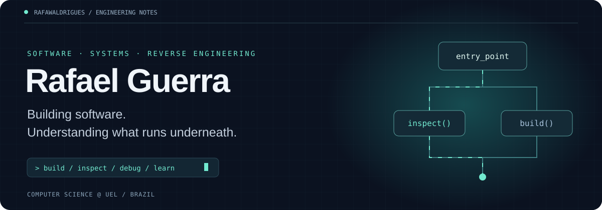

  

# Rafael Guerra Waldrigues

Full stack developer and Computer Science student at **UEL, Brazil**. I build web and mobile products end to end, and in my free time I take software apart: **reverse engineering, binary analysis and application security** are what I enjoy most.

Currently a **Full Stack Intern at ORV**. Graduating in **July 2027**.

[LinkedIn](https://www.linkedin.com/in/rafael-guerra-05b042248/) · [waldriguesrafa@gmail.com](mailto:waldriguesrafa@gmail.com) · Portuguese (native) · English (advanced)

## Featured work

- **[JADX Atlas](https://github.com/Rafawaldrigues/jadx-atlas)** — attack-surface map for Android apps, built on JADX output. It shows which components are exposed, what each class is even when the name is `a.b.c`, where sensitive APIs are used, and possible paths from an exposed entry point to the code worth reviewing. Runs locally, and every result carries its confidence and the file and line it comes from. Python, Tree-sitter, 30 rule-based checks, version diff and exportable reports.
- **[ASM X](https://github.com/Rafawaldrigues/x86-assembly-visualizer)** — x86-64 assembly simulator and source viewer. Step through programs, inspect registers and memory, and catch common mistakes before assembling. Python, no runtime dependencies.
- **[C Compiler Frontend](https://github.com/Rafawaldrigues/c-compiler-frontend)** — lexer and parser in C: Flex/Bison phases plus a hand-written recursive-descent parser.
- **[Network Tools](https://github.com/Rafawaldrigues/network-tools)** — TCP/UDP socket projects covering reliable delivery, file integrity, packet loss and throughput measurement.

## What I do

**Full stack**
Backend APIs with FastAPI, PostgreSQL, JWT auth and role-based permissions; web frontends in TypeScript; native iOS in Swift; automation, integrations, deployment and VPS administration.

**Reverse engineering and security**
Android and native binary analysis, static analysis and control-flow recovery, x86-64 internals, fuzzing and vulnerability research fundamentals. I like building the tools I wish I had while reading someone else's code.

## Stack

**Security tooling:** JADX · Ghidra · gdb · x64dbg · Burp Suite · AFL++

## Experience

<b>ORV</b> — Full Stack Intern · Jul 2026–present

 

Native iOS development in Swift, FastAPI services, automation and integrations, client-facing applications, deployment and VPS administration.

<b>PET-Saúde I&amp;SD / UEL</b> — Backend Developer · Mar 2025–Jul 2026

 

Built a FastAPI REST API for patient and appointment data. Implemented JWT authentication and role-based permissions, integrated PostgreSQL, wrote endpoint tests, and supported production deployment and logs.

## Open to

Full stack roles, and entry-level positions in reverse engineering, vulnerability research and application security.

<picture>
  <source media="(prefers-color-scheme: dark)" srcset="snake-dark.svg">
  
</picture>
